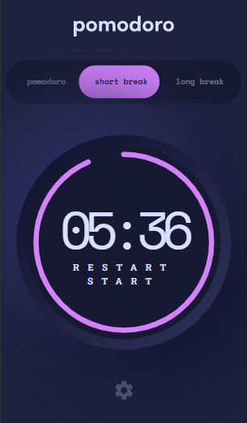
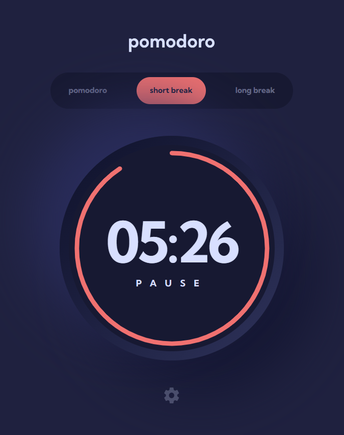
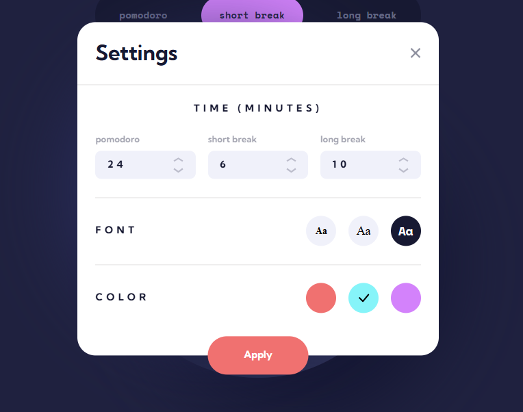

# Frontend Mentor - Pomodoro app solution

This is a solution to the [Pomodoro app challenge on Frontend Mentor](https://www.frontendmentor.io/challenges/pomodoro-app-KBFnycJ6G). Frontend Mentor challenges help you improve your coding skills by building realistic projects. 

## Table of contents

- [Overview](#overview)
  - [The challenge](#the-challenge)
  - [Screenshot](#screenshot)
  - [Links](#links)
- [My process](#my-process)
  - [Built with](#built-with)
  - [What I learned](#what-i-learned)
  - [Continued development](#continued-development)
  - [Useful tools](#useful-resources)
- [Author](#author)

## Overview

### The challenge

Users should be able to:

- Set a pomodoro timer and short & long break timers
- Customize how long each timer runs for
- See a circular progress bar that updates every minute and represents how far through their timer they are
- Customize the appearance of the app with the ability to set preferences for colors and fonts

### Screenshot

### Links

- Solution URL: [https://github.com/faisalalmail/Pomodoro-app](https://github.com/faisalalmail/Pomodoro-app)
- Live Site URL: [https://pomodoroapp-ebon.vercel.app/](https://pomodoroapp-ebon.vercel.app/)

## My process

### Thoughts

- While this project is a single page, it packs a load of work in JS, working with a timer and a settings modal to customize the view is a new thing for me so that is going to be fun.

- I have a concept of how to produce the circular progress bar around the circle, which is to use a 50% border radius div and use JS to calculate the remaining time >> progress in percentage and convert that to how far the border goes (not sure how its done or if its the right way).

**The above was written in the start - The below after finishing the project**

- Boy has this project been fun, while it is a single page, I can say its pretty complicated, there is alot JS going on, I even checked some other's solutions in the begginning and I saw theirs laggy or misses the point of being useful because it was just implemented to finish the challenge instead of being fully functiona and actually useable in a real life scenario.

In this project I prefer to add my own features to make sure that:
- The app saves your settings, so:
  * timers dont reset when you refresh or close the page
  * your settings are saved, you will not have to set the time every time you use the app

### Built with

- Semantic HTML5 markup
- CSS custom properties
- Flexbox
- CSS Grid
- Mobile-first workflow

### What I learned

- I can say that I learned some big DOM manipulation because of how this project works.
- Working with SVGs
- localstorage
- data arrays and objects

### Continued development

I have been waiting for this, next is to jump into a JS library.

### Useful tools

https://mycolor.space/gradient
https://cssgenerator.org/box-shadow-css-generator.html

## Author

- Website - [Faisal Almail](https://serene-tiramisu-c891db.netlify.app/)
- Frontend Mentor - [@faisalAlmail](https://www.frontendmentor.io/profile/faisalalmail)
- GitHub - [@FaisalAlmail](https://github.com/faisalalmail)

